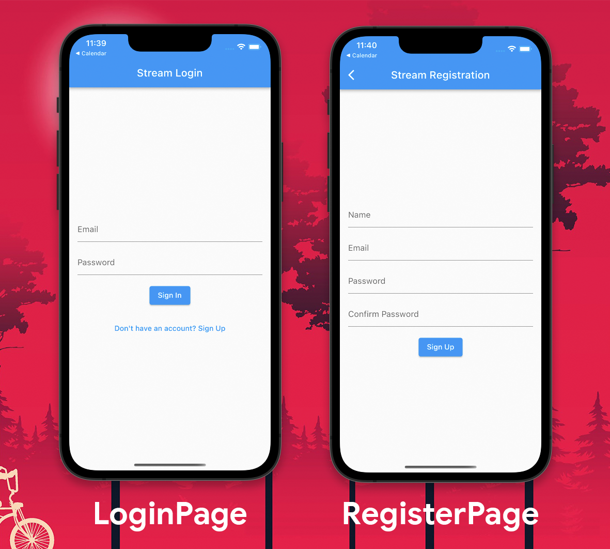
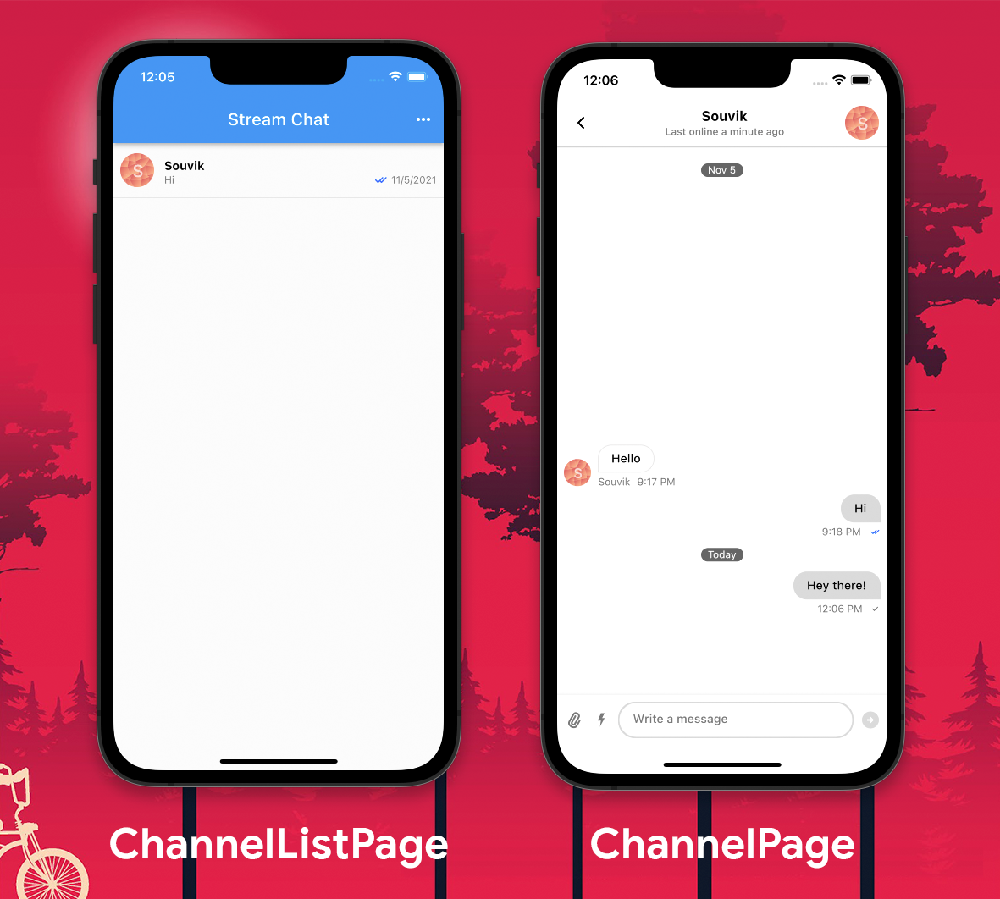

# Serverless authentication in Messaging App using Flutter and Firebase 🔥

This project shows how to implement a serverless authentication system using [Firebase Authentication](https://firebase.google.com/docs/auth) and [Cloud Functions](https://firebase.google.com/docs/functions) in your [Stream](https://getstream.io/) messaging app.

## Authentication Screens



## Stream Messaging Screens



## Project structure 🏗️

The `lib` directory contains the Dart code of the Flutter app, it is distributed in the following directories:

* **screens:** contains all the Flutter app screens
* **utils:** contains the utility classes for authentication and Stream client

## Requirements 🧪

Some prerequisites to run this project:

* **Flutter 2 with null safety enabled** (it is tested on Flutter v2.5.3): You can install it from the [Flutter website](https://flutter.dev/docs/get-started/install).

* **Setup Stream app:** You can sign up for a Stream account at [getstream.io](https://getstream.io/dashboard/signup), and get the free trial of Stream's Chat Messaging by going [here](https://getstream.io/chat/trial/).

* **Setup Firebase project:** You can to the [Firebase console](https://console.firebase.google.com/) and create a new project.

## Usage 👨‍💻

For building and running this project locally, follow the steps below:

* Clone this repository:

   ```sh
   git clone https://github.com/sbis04/stream_auth_firebase.git
   ```

* Navigate to the project directory:
  
  ```sh
  ch stream_auth_firebase
  ```

* Get Flutter dependencies:
  
  ```sh
  flutter pub get
  ```

* Create a `secrets.dart` dart file inside the `lib` directory with the following content:
  
  ```dart
  // Stream API Key
  const streamKey = 'your-stream-key';
  ```

* Add your Firebase secret files, `google-services.json` for Android and `GoogleService-Info.plist` for iOS to the respective directories.

* Run the app:
  
  ```sh
  flutter run
  ```

## License 📝

Copyright (c) 2021 Souvik Biswas

Permission is hereby granted, free of charge, to any person obtaining a copy
of this software and associated documentation files (the "Software"), to deal
in the Software without restriction, including without limitation the rights
to use, copy, modify, merge, publish, distribute, sublicense, and/or sell
copies of the Software, and to permit persons to whom the Software is
furnished to do so, subject to the following conditions:

The above copyright notice and this permission notice shall be included in all
copies or substantial portions of the Software.

THE SOFTWARE IS PROVIDED "AS IS", WITHOUT WARRANTY OF ANY KIND, EXPRESS OR
IMPLIED, INCLUDING BUT NOT LIMITED TO THE WARRANTIES OF MERCHANTABILITY,
FITNESS FOR A PARTICULAR PURPOSE AND NONINFRINGEMENT. IN NO EVENT SHALL THE
AUTHORS OR COPYRIGHT HOLDERS BE LIABLE FOR ANY CLAIM, DAMAGES OR OTHER
LIABILITY, WHETHER IN AN ACTION OF CONTRACT, TORT OR OTHERWISE, ARISING FROM,
OUT OF OR IN CONNECTION WITH THE SOFTWARE OR THE USE OR OTHER DEALINGS IN THE
SOFTWARE.
